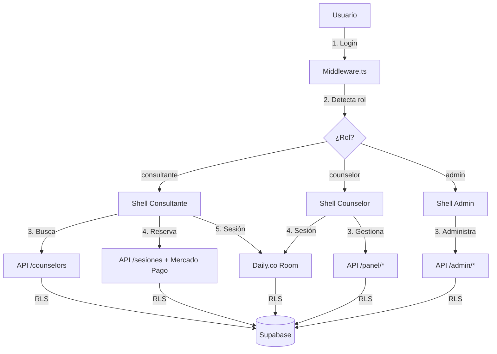

# Arquitectura — Newen

## Propósito
Describir la arquitectura completa de Newen: componentes frontend y backend, flujo de datos, integraciones externas y modelo de seguridad.

## Stack

| Capa | Tecnología | Versión |
|---|---|---|
| Framework | Next.js (App Router) | 15 |
| UI | React + TypeScript | 19 + 5.x |
| Estilos | Tailwind CSS | 4 |
| Base de datos | Supabase PostgreSQL | Última |
| Auth | Supabase Auth (Google OAuth + email) | — |
| Videollamada | Daily.co | SDK React |
| Pagos | Mercado Pago | Checkout Pro |
| Email | Resend | API |
| Deploy | Vercel | Hobby/Pro |
| PWA | next-pwa + Web Manifest | — |

## Diagrama de flujo



## Tres shells arquitectónicos

```
app/
├── (consultante)/          ← Route Group: layout + navbar consultante
│   ├── layout.tsx          ← BottomNav: Buscar · Sesiones · Cuenta
│   ├── page.tsx            ← Home: búsqueda por situación
│   ├── buscar/page.tsx     ← Listado con filtros
│   ├── counselor/[id]/page.tsx
│   ├── reservar/[id]/page.tsx
│   ├── sesion/[id]/page.tsx
│   ├── evaluar/[id]/page.tsx
│   └── mi-cuenta/page.tsx
│
├── (counselor)/            ← Route Group: layout + navbar counselor
│   ├── layout.tsx          ← BottomNav: Panel · Agenda · Comunidad
│   └── panel/
│       ├── page.tsx        ← Dashboard
│       ├── agenda/page.tsx
│       ├── sesion/[id]/page.tsx
│       ├── colaborativo/page.tsx
│       ├── talleres/page.tsx
│       └── perfil/page.tsx
│
├── (admin)/                ← Route Group: layout + navbar admin
│   ├── layout.tsx
│   └── admin/
│       ├── page.tsx
│       ├── postulaciones/page.tsx
│       ├── entrevista/[id]/page.tsx
│       ├── counselors/page.tsx
│       └── empresas/page.tsx
│
└── api/
    ├── auth/
    ├── counselors/
    ├── sesiones/
    ├── pagos/              ← Webhook Mercado Pago
    ├── evaluaciones/
    ├── daily/              ← Crear sala Daily.co
    └── admin/
```

## Middleware de protección

El middleware (`middleware.ts`) es la única puerta de entrada. Responsabilidades:
1. Verificar sesión de Supabase.
2. Obtener rol del usuario desde `users.rol`.
3. Bloquear rutas no autorizadas por rol.
4. Redirección post-login al shell correcto.

## Flujo de sesión

```
Consultante → Reserva ($22 USD) → Mercado Pago → Webhook confirma
  → Crea sala Daily.co → Sesión en vivo (50 min)
  → Evaluación obligatoria (1-5 ★) → Libera próxima reserva
```

## Flujo corporativo

```
Empresa → Membresía mensual → Empleados acceden
  → Sesión corporativa ($35 USD al counselor)
  → Newen retiene $13 USD/sesión
  → Counselor no sabe que es corporativa
```

## Seguridad

- PSAI v1.3 aplicado como protocolo base.
- RLS en todas las tablas de Supabase.
- API keys NUNCA en frontend (`NEXT_PUBLIC_*` solo para keys anónimas).
- Middleware como única puerta de entrada.
- Datos de salud: encriptación + auditoría + no compartidos con terceros.
